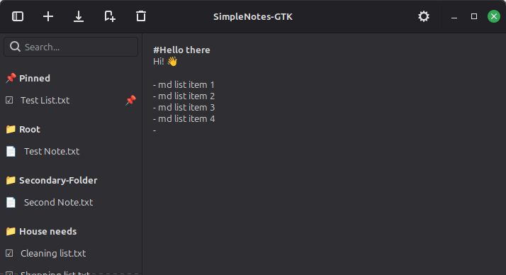
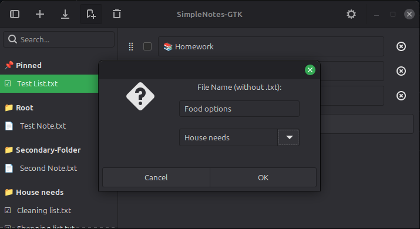
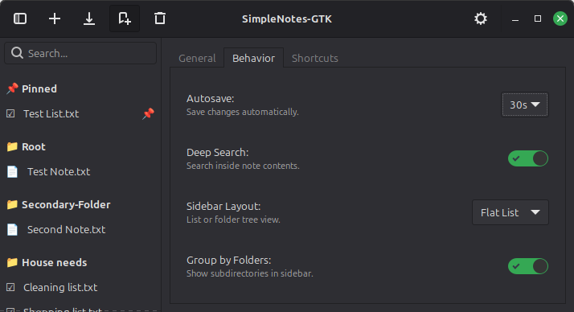
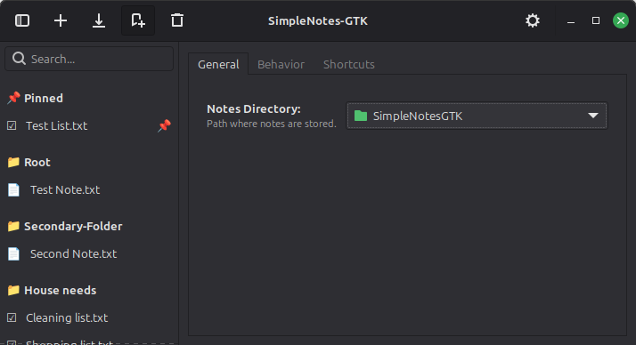
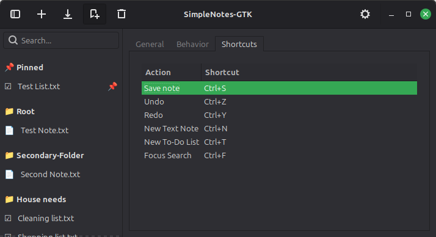

# SimpleNotes-GTK 🍃

A minimalist & lightweight note-taking app, built to be simple yet reliable.

GTK based app meant to work along the android app [Fossify Notes](https://github.com/FossifyOrg/Notes) using a syncing service like [syncthing](https://github.com/syncthing/syncthing)  
or as a simple day to day notetaking app.

## Caracteristics
- 📝 Plain text notes with basic Markdown higliting for unordered lists and titles.  

- ✅ To-Do lists with .JSON formating.  

- #️⃣ QoL options.  
  
- 📁 Folder organization & Pinned notes.  

- ⌨️ Essential Keybinds.  


## Instalation

📦 Option 1: Flatpak.

The most recommended way to install SimpleNotes-GTK on any Linux distribution (Ubuntu, Fedora, Arch, SteamOS).  
Download the `simplenotes.flatpak` from the [latest Release](https://github.com/MemuGG64/SimpleNotes_GTK/releases).

Install it by double-clicking the file or using the terminal:
```Bash
flatpak install ./simplenotes.flatpak
```

📦 Option 2: Debian Package.

The easiest way to install SimpleNotes-GTK on Ubuntu, Debian, Linux Mint, or Pop!_OS is by using the .deb package.  
Download the [latest Release](https://github.com/MemuGG64/SimpleNotes_GTK/releases).  
Install it by oppening the .deb or using your terminal:
```Bash
sudo apt install ./simplenotes-gtk_1.1.0_all.deb
```
🛠️ Option 2: Run from Source

If you prefer to run the application without installing it, Clone the repository:
```Bash
git clone https://github.com/MemuGG64/SimpleNotes_GTK.git
cd SimpleNotes_GTK
```
Install dependencies:
```Bash
sudo apt install python3-gi python3-gi-cairo gir1.2-gtk-3.0
```
Run the script:
```Bash
python3 SimpleNotes.py
```
  
**Disclaimer:**  
AI was used to make this app
